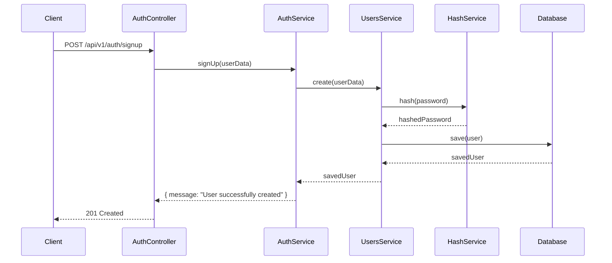
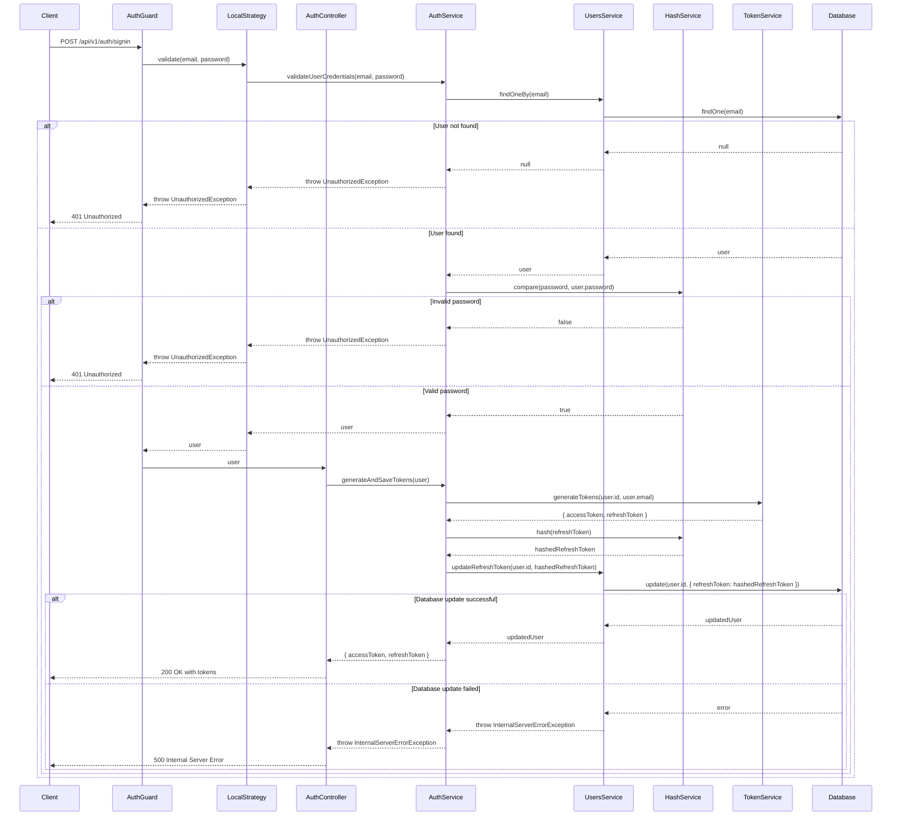
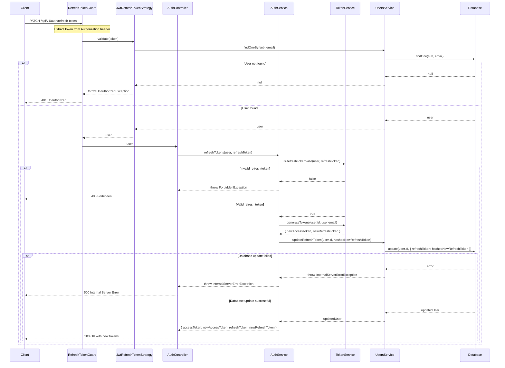
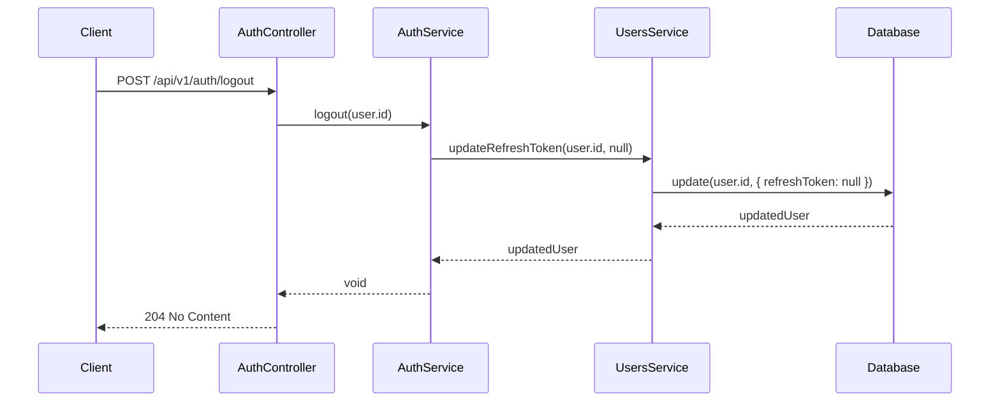
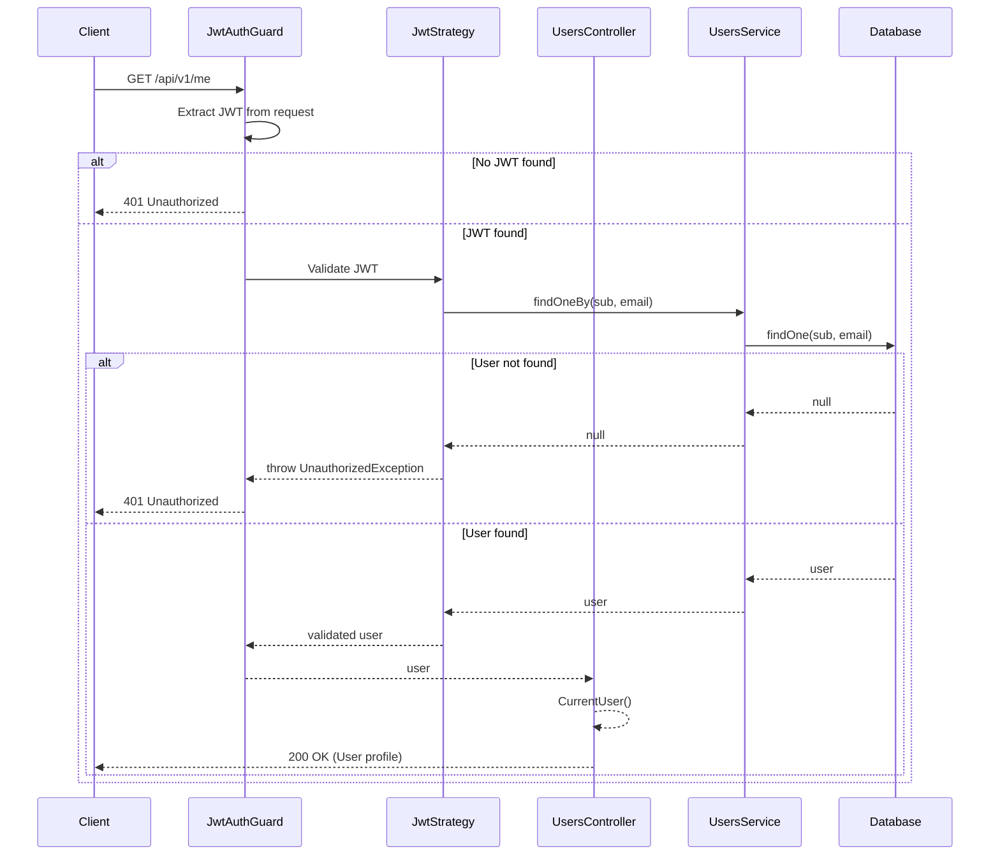

# NestJS Authentication and Authorization Project

This project is a robust NestJS application that implements user authentication and authorization, including registration, login, and protected routes. It uses MongoDB for data storage and includes both RESTful API and GraphQL endpoints.

## Features

- User registration and login
- JWT-based authentication with access and refresh tokens
- Password hashing using bcrypt
- Protected routes using Guards
- Refresh token mechanism
- Logout functionality
- GraphQL integration
- Swagger API documentation
- Environment variable validation
- Unit and E2E testing setup
- MongoDB integration using Mongoose
- Input validation using class-validator
- Response serialization
- Rate limiting
- Compression middleware
- Helmet for security headers

## Prerequisites

- Node.js (v21 or later)
- yarn package manager
- MongoDB instance

## Project Setup

1. Clone the repository:
   ```shell
   git clone https://github.com/ahmdhusam/nest-auth-api.git
   cd nest-auth-api
   ```

2. Install dependencies:
   ```shell
   yarn install
   ```

3. Set up environment variables:
   Create a `.env` file in the root directory and add the following variables:

   ```
   NODE_ENV=development
   PORT=3000
   MONGODB_URI=mongodb://localhost:27017/your-database-name
   JWT_ACCESS_SECRET=your-access-secret
   JWT_ACCESS_EXPIRES_IN=15m
   JWT_REFRESH_SECRET=your-refresh-secret
   JWT_REFRESH_EXPIRES_IN=7d
   ```

   Replace the values with your specific configuration.

## Running the Application

1. Start the development server:
   ```shell
   yarn run start:dev
   ```

2. The application will be available at `http://localhost:3000`

## API Documentation

Once the application is running, you can access the Swagger API documentation at:

```
http://localhost:3000/api/v1/docs
```

This provides an interactive interface to explore and test the API endpoints.

## GraphQL Playground

The GraphQL playground is available at:

```
http://localhost:3000/graphql
```

You can use this to interact with the GraphQL API.

## Available Scripts

- `yarn run start`: Starts the application in production mode
- `yarn run start:dev`: Starts the application in development mode with watch
- `yarn run start:debug`: Starts the application in debug mode
- `yarn run build`: Builds the application
- `yarn run test`: Runs unit tests
- `yarn run test:e2e`: Runs end-to-end tests
- `yarn run lint`: Lints the codebase
- `yarn run format`: Formats the codebase

## Project Structure

- `src/`: Contains the source code of the application
  - `auth/`: Authentication related modules and services
  - `users/`: User management modules and services
  - `common/`: Shared modules and services
  - `core/`: Core functionality and utilities
  - `utils/`: Utility functions and helpers

## Testing

**To run unit tests:**

```shell
yarn test
```

**To run e2e tests:**

*Note: This test requires a database connection. Please modify the MONGODB_URI in the .env file before running the tests.*

```shell
yarn test:e2e
```

## Code Quality

### Linting

To lint the codebase:

```shell
yarn lint
```

This will run ESLint to check for code style and potential errors.

### Formatting

To format the codebase:

```shell
yarn format
```

## Sequence Diagrams

### Sign Up

This process handles user registration.



Steps:
1. Client sends a POST request to `/api/v1/auth/signup` with user data.
2. AuthController calls AuthService's signUp method.
3. AuthService uses UsersService to create a new user.
4. UsersService hashes the password using HashService.
5. The new user is saved in the database.
6. A success message is returned to the client.


### Sign In

This process authenticates a user and provides access tokens using Passport Local Strategy.



Steps:
1. Client sends a POST request to `/api/v1/auth/signin` with credentials.
2. The request is intercepted by the LocalAuthGuard.
3. LocalAuthGuard uses LocalStrategy to validate the credentials.
4. LocalStrategy calls AuthService to validate user credentials.
5. AuthService uses UsersService to find the user by email.
6. If the user is found, HashService compares the provided password with the stored hash.
7. If credentials are valid, the user object is passed back through the strategy and guard.
8. AuthController calls AuthService to generate and save tokens.
9. TokenService generates access and refresh tokens.
10. The refresh token is hashed and stored in the database.
11. Both tokens are returned to the client.

### Refresh Token

This process allows a client to obtain a new access token using a refresh token. It utilizes the JWT Refresh Token Strategy and Guard for authentication.



Steps:
1. Client sends a PATCH request to `/api/v1/auth/refresh-token` with the refresh token in the Authorization header.
2. The request is intercepted by the RefreshTokenGuard, which uses the JwtRefreshTokenStrategy.
3. JwtRefreshTokenStrategy validates the refresh token and retrieves the user.
4. If the token is valid, AuthService validates the refresh token again and generates new tokens.
5. The new refresh token is hashed and stored in the database.
6. Both new tokens are returned to the client.

### Logout

This process invalidates a user's refresh token, effectively logging them out.



Steps:
1. Client sends a POST request to `/api/v1/auth/logout`.
2. AuthService calls UsersService to update the user's refresh token to null.
3. The database is updated to remove the refresh token.
4. A 204 No Content response is sent to the client, indicating successful logout.

### Get User Profile

This process retrieves the authenticated user's profile information.



Steps:
1. Client sends a GET request to `/api/v1/me` with a JWT in the Authorization header.
2. JwtAuthGuard validates the JWT.
3. If valid, UsersService retrieves the user's profile from the database.
4. The user's profile is returned to the client.

The `/api/v1/me` endpoint is protected by the JwtAuthGuard, ensuring that only authenticated users can access their profile information. The endpoint returns the current user's profile data, which is serialized using the UserSerialize class to exclude sensitive information like the password.


These sequence diagrams provide a visual representation of the flow for the main authentication routes in the application.

### GraphQL Operations

This section describes the main GraphQL operations available in the application.

#### Get User Profile (GraphQL)

This query retrieves the authenticated user's profile information using GraphQL.

Steps:
1. Client sends a GraphQL query for `me`.
2. JwtAuthGuard validates the JWT token.
3. If valid, UsersResolver's `me` method is called.
4. UsersService retrieves the user's profile from the database.
5. The user's profile is returned to the client as a UserModel.

## GraphQL Query

1. **Schema Exploration**: Use the GraphQL Playground (available at `http://localhost:3000/graphql` when running the application locally) to explore the schema, available queries, and mutations.

2. **Authentication**: GraphQL operations require authentication. Include the JWT token in the HTTP headers of your GraphQL requests:

```json
{
  "Authorization": "Bearer YOUR_JWT_TOKEN"
}
```


To fetch the user profile, you can use the following GraphQL query:


```graphql
query {
  me {
    id
    email
    firstName
    lastName
  }
}
```

This query will return the user's id, email, firstName, and lastName.